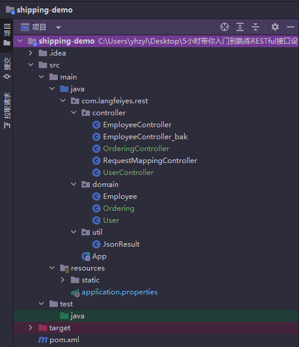
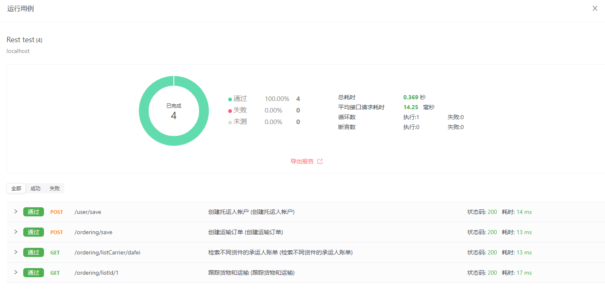

# 物流管理系统个人作业
## 作业1：航运和运输 Web 服务 API 开发---Restful API
```markdown
在此作业中，系统会要求您为运输订购服务开发 Restful 服务 API。
要求：
	1，您的API需要涵盖托运人运送货物的基本要求。通常
		创建托运人帐户
		创建运输订单
		检索不同货件的承运人账单
		跟踪货物和运输
	2，使用工具进行Restful API设计，例如swagger-gen（https://swagger.io/）ApiFox（https://www.apifox.com/），ApiPost7（https://www.apipost.cn/）。
	3，每个服务的 URI 版本控制和 JSON/XML 有效负载。
	4、API密钥和附加认证是可选的。

交货：
 	1，您需要将项目源代码以及运行和测试屏幕捕获存档到 github 存储库。
	2、提供系统设计报告是必要的。
	3、交期2023-4-30
```
- 代码结构快速一览
	- 
	- 

### 1 创建托运人帐户---/user/save
- 见 UserController

### 2 创建运输订单---/ordering/save
- 见 OrderingController

### 3 检索不同货件的承运人账单---/ordering/listCarrier/{carrier}
- 见 OrderingController

### 4 跟踪货物和运输---/ordering/listId/{id}
- 见 OrderingController

### 测试报告
- **测试报告详情链接：**[apifox-reports](./apifox-reports-2023-05-01-01-29-12.html
- 
- 

